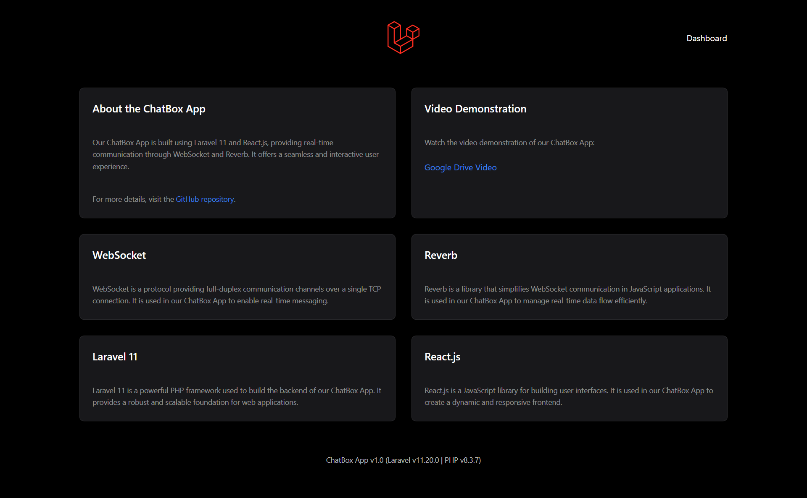
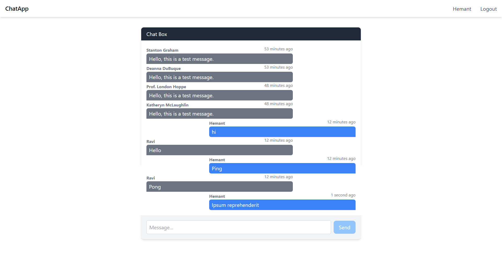

# Web Chat Application Using Web Socket

A web chat application built using Laravel 11, Reverb, Broadcasting, Pest, React.js, Tailwind Css, Vite.js, and MySQL.

## Table of Contents

- [Prerequisites](#prerequisites)
- [Installation](#installation)
- [Configuration](#configuration)
- [Running the Application](#running-the-application)
- [Running Tests](#running-tests)
- [Usage](#usage)
- [License](#license)
- [Repository](#repository)
- [Screenshots](#screenshots)
- [Video](#video)

## Prerequisites

Ensure you have the following installed:

- [PHP](https://www.php.net/) (version 8.1 or higher)
- [Composer](https://getcomposer.org/)
- [Node.js](https://nodejs.org/)
- [MySQL](https://www.mysql.com/)
- [Laravel](https://laravel.com/) (version 11)
- [Reverb](https://reverb.dev/)
- [Vite](https://vitejs.dev/)

## Installation

1. **Clone the repository:**

    ```bash
    git clone https://github.com/Hemantkumawat/chat-web-app/tree/main
    cd chat-web-app
    ```

2. **Install PHP dependencies:**

    ```bash
    composer install
    ```

3. **Install Node.js dependencies:**

    ```bash
    npm install
    ```

4. **Copy the example environment file:**

    ```bash
    cp .env.example .env
    ```

5. **Generate an application key:**

    ```bash
    php artisan key:generate
    ```

6. **Configure your `.env` file:**

    - Set your database connection details:

      ```env
      DB_CONNECTION=mysql
      DB_HOST=127.0.0.1
      DB_PORT=3306
      DB_DATABASE=your_database
      DB_USERNAME=your_username
      DB_PASSWORD=your_password
      ```

    - Set the broadcasting configuration:

      ```env
      BROADCAST_DRIVER=verb
      VERB_APP_ID=your_verb_app_id
      VERB_APP_KEY=your_verb_app_key
      VERB_APP_SECRET=your_verb_app_secret
      VERB_APP_CLUSTER=your_verb_app_cluster
      ```

7. **Run the migrations to set up the database schema:**

    ```bash
    php artisan migrate
    ```

8. **Seed the database with initial data (if any):**

    ```bash
    php artisan db:seed
    ```

## Configuration

1. **Reverb Configuration:**

   Follow the [Reverb documentation](https://reverb.dev/docs) to configure Reverb for broadcasting.

2. **Broadcasting Configuration:**

   Ensure your broadcasting configuration in `config/broadcasting.php` is set correctly for Reverb.

3. **Vite Configuration:**

   Configure Vite by updating `vite.config.js` according to your project needs.

## Running the Application

1. **Build the assets:**

    ```bash
    npm run build
    ```

2. **Start the Laravel development server:**

    ```bash
    php artisan serve
    ```

   By default, this will start the server at `http://127.0.0.1:8000`.

3. **Start the Vite development server:**

    ```bash
    npm run dev
    ```

   This will start the Vite development server and enable hot module replacement.

4. **Start the Reverb server:**

    ```bash
    php artisan reverb:serve
    ```

5. **Start the queue listener:**

    ```bash
    php artisan queue:listen
    ```

6. **Start the Reverb server:**

    ```bash
    php artisan reverb:start
    ```

## Running Tests

1. **Run PHP tests with Pest:**

    ```bash
    ./vendor/bin/pest
    ```

2. **Run JavaScript tests (if applicable):**

    ```bash
    npm test
    ```

## Usage

- **Register and Login:** Access the registration and login pages at `/register` and `/login`.
- **Chat:** Once logged in, navigate to `/home` to access the chat interface.

## License

This project is Open source \- Whoever wants to use or contribute in it are most welcome.

## Repository

For more details, visit the [GitHub repository](https://github.com/Hemantkumawat/chat-web-app/tree/main).

## Screenshots

Here are some screenshots of the ChatBox App:




## Video

For a video demonstration, visit the [Video Link](https://drive.google.com/file/d/1X7u6FUzc6Ul31apISsb1E45Z6wSUedQ1/view?usp=sharing).
